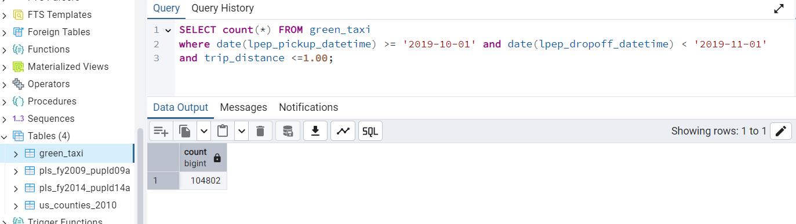
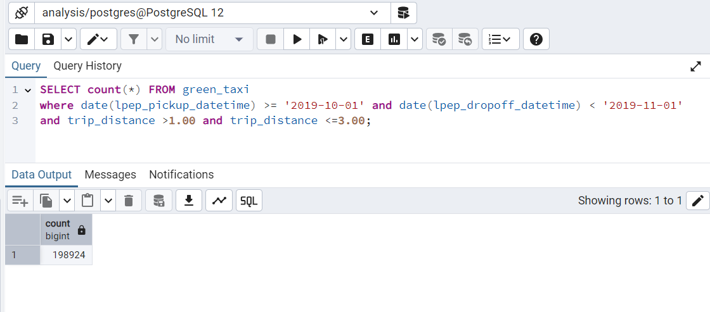
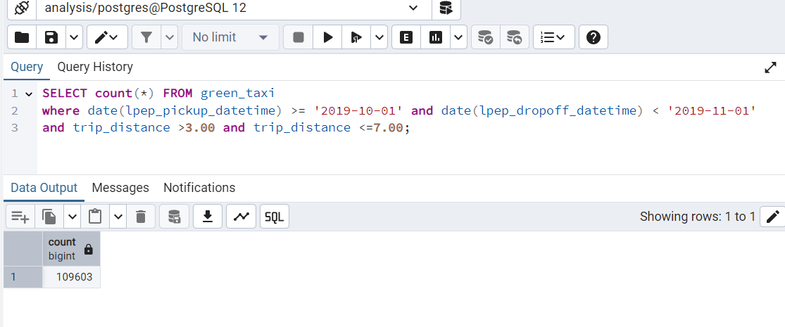
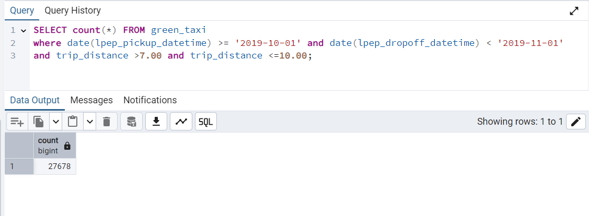
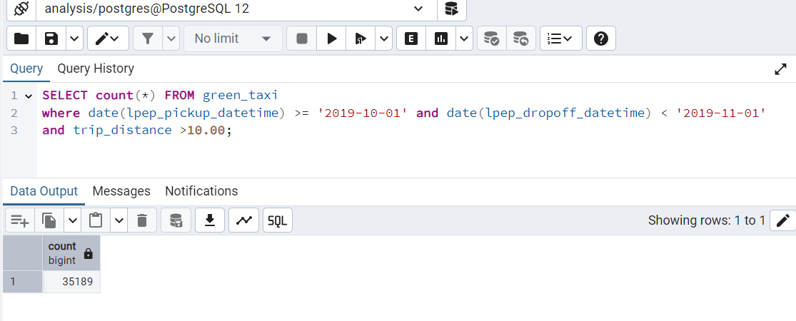

# Dataengineering_zoomcamp_2025
## Question 3. Trip Segmentation Count

During the period of October 1st 2019 (inclusive) and November 1st 2019 (exclusive), how many trips, **respectively**, happened:
1. Up to 1 mile

2. In between 1 (exclusive) and 3 miles (inclusive),

4. In between 3 (exclusive) and 7 miles (inclusive),

5. In between 7 (exclusive) and 10 miles (inclusive),

6. Over 10 miles

Answer: - 104,802;  198,924;  109,603;  27,678;  35,189
