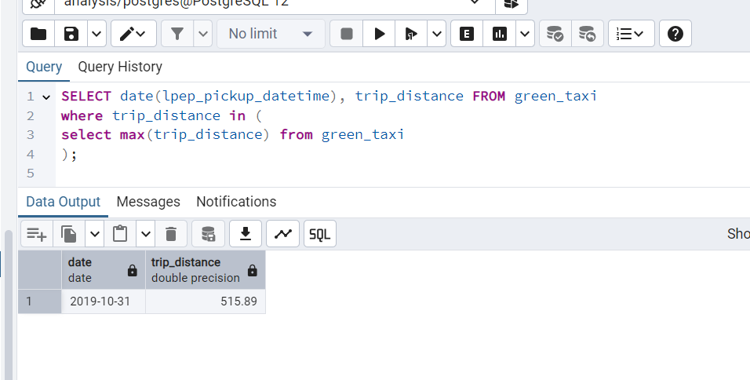
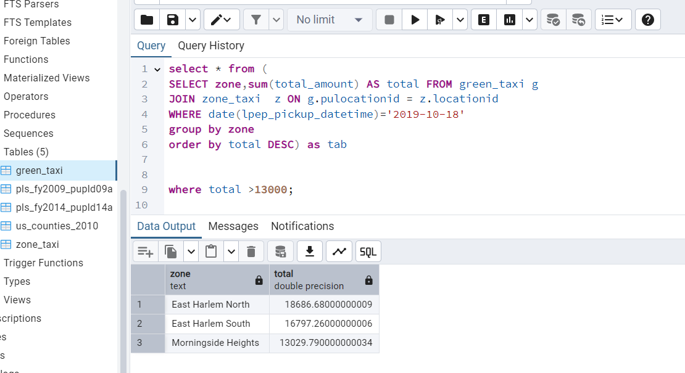
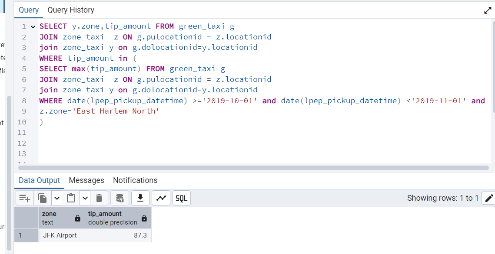

# Dataengineering_zoomcamp_2025
# Homework 1
## Question 3. Trip Segmentation Count

During the period of October 1st 2019 (inclusive) and November 1st 2019 (exclusive), how many trips, **respectively**, happened:
1. Up to 1 mile

2. In between 1 (exclusive) and 3 miles (inclusive),

4. In between 3 (exclusive) and 7 miles (inclusive),

5. In between 7 (exclusive) and 10 miles (inclusive),

6. Over 10 miles

Answer: - 104,802;  198,924;  109,603;  27,678;  35,189

## Question 4. Longest trip for each day

Which was the pick up day with the longest trip distance?
Use the pick up time for your calculations.

Tip: For every day, we only care about one single trip with the longest distance. 

Answer: - 2019-10-31

## Question 5. Three biggest pickup zones

Which were the top pickup locations with over 13,000 in
`total_amount` (across all trips) for 2019-10-18?

Consider only `lpep_pickup_datetime` when filtering by date.

Answer: - East Harlem North, East Harlem South, Morningside Heights

## Question 6. Largest tip

For the passengers picked up in October 2019 in the zone
named "East Harlem North" which was the drop off zone that had
the largest tip?

Note: it's `tip` , not `trip`

We need the name of the zone, not the ID.

Answer: - JFK Airport

