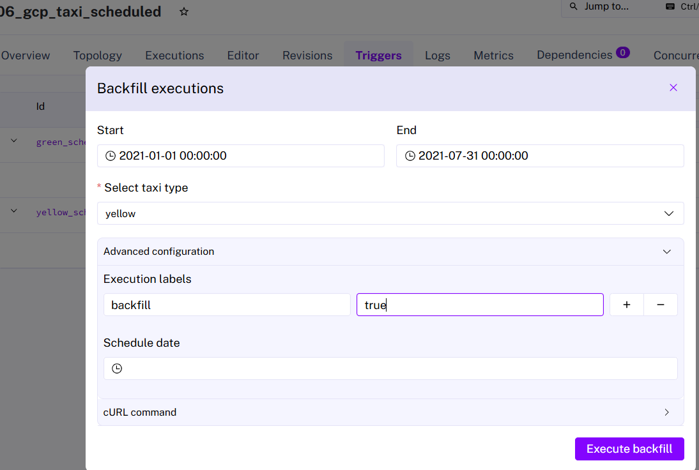
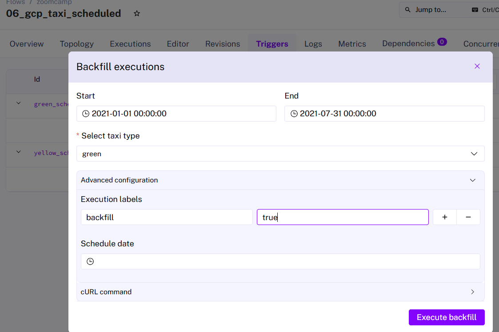
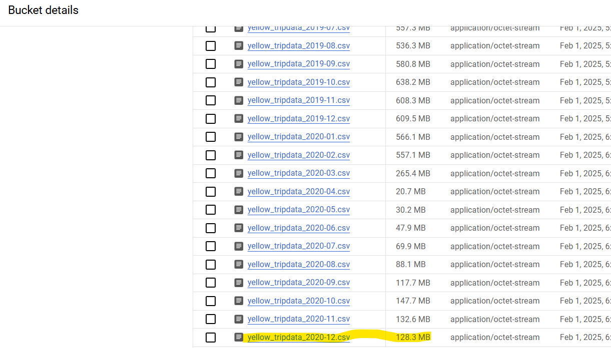

# Dataengineering_zoomcamp_2025
# Homework 2
# Module 2 Homework
So far in the course, we processed data for the year 2019 and 2020. Your task is to extend the existing flows to include data for the year 2021





using the scheduling flow to update the values backfill from 2021 january to 2021 july

# Quiz Questions
## Question 1.
1. Within the execution for Yellow Taxi data for the year 2020 and month 12: what is the uncompressed file size (i.e. the output file yellow_tripdata_2020-12.csv of the extract task)?


### Answer: 128.3 MB
## Question 2.
2. What is the rendered value of the variable file when the inputs taxi is set to green, year is set to 2020, and month is set to 04 during execution?
### Answer : green_tripdata_2020-04.csv

## Question 3.
3. How many rows are there for the Yellow Taxi data for all CSV files in the year 2020?

The following query was exicuted on the bigquery. merged yellow_tripdata table

```sql
SELECT COUNT(*) AS row_count
FROM `sunny-studio-449422-q9.zoomcamp.yellow_tripdata`
WHERE EXTRACT(YEAR FROM tpep_pickup_datetime) = 2020; ```

### Answer: 24,648,499
## Question 4.
4. How many rows are there for the Green Taxi data for all CSV files in the year 2020? 

### Answer: 1,734,051
